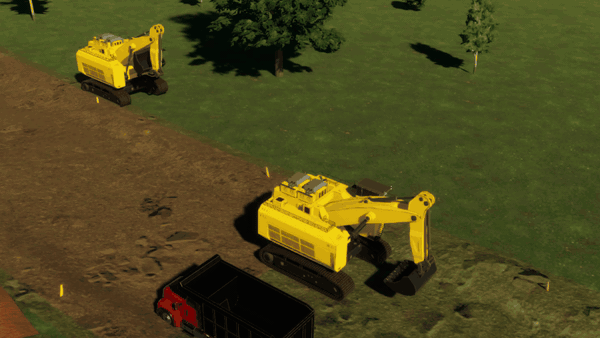
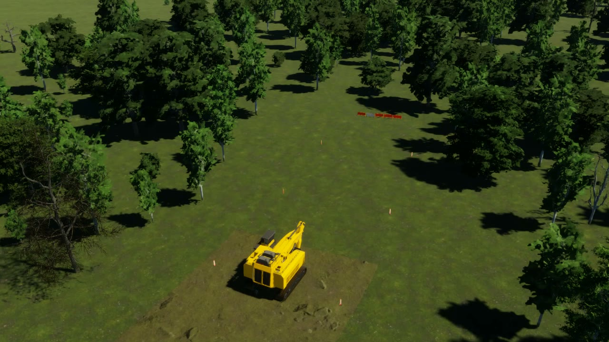
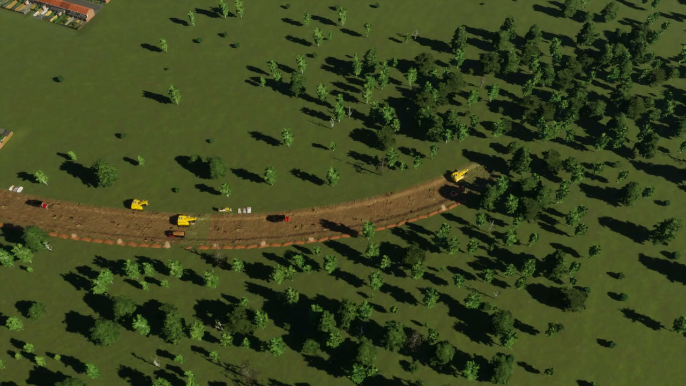
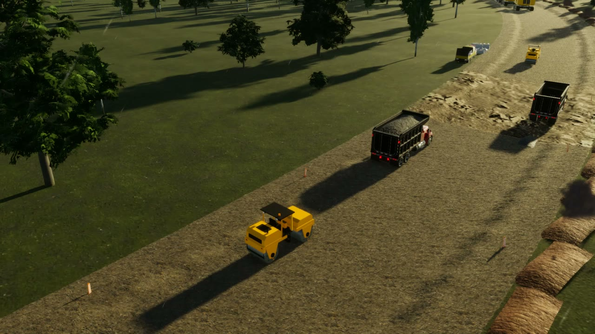
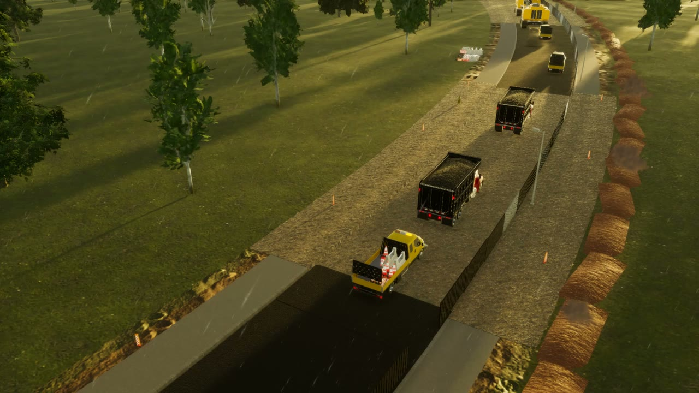
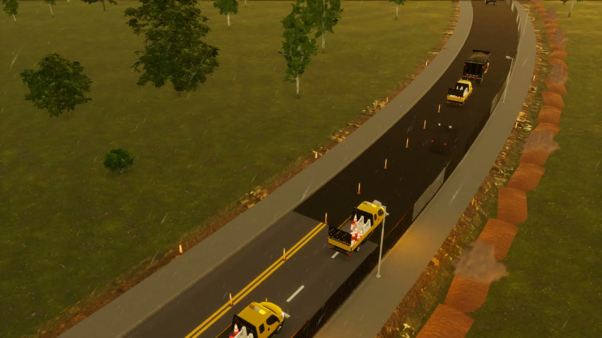
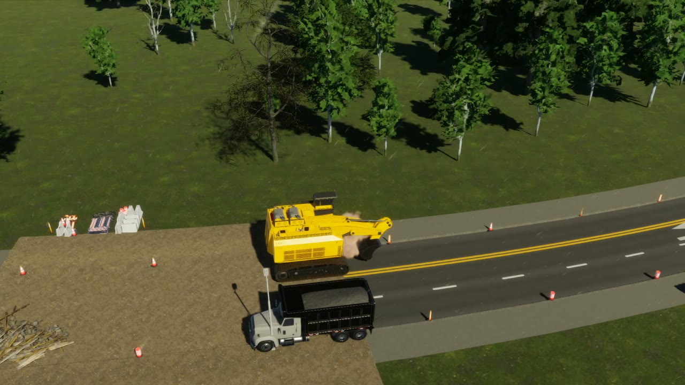

# Realistic Road Works

[Paradox Mods](https://mods.paradoxplaza.com/mods/162194/Windows) · [Latest release](https://github.com/jasperaelvoet/realistic-road-works/releases/latest) · [Showcase video](https://github.com/jasperaelvoet/realistic-road-works/releases/download/v3.0.0/realistic-road-works-showcase.mp4)

A code mod for Cities: Skylines II that turns road building into real road works. A new road does not appear the moment you
release the mouse. It is surveyed, dug out, given a gravel foundation, paved and marked, with the trench in the actual terrain and
excavators, dump trucks, rollers, a paver and a line painter working at believable speeds. Bulldozing a road starts a demolition
that breaks it up, removes the road bed and restores the ground. While the works run, the site is closed and traffic finds another
way. Near the end, the sidewalks and then one direction open early. Apart from a road roller mesh the mod builds itself, everything
uses the game's own assets, and the save keeps only one small component per road segment under works.

## Media

**[▶ Watch the showcase video](https://github.com/jasperaelvoet/realistic-road-works/releases/download/v3.0.0/realistic-road-works-showcase.mp4)** (about 3 minutes: a road built through a forest, then a street demolished).

| | |
| --- | --- |
|  |  |
|  |  |
|  |  |

## Features

### Construction

- **Roads take time.** By default a road takes 48 in-game working hours per kilometre to build, with a 6-hour minimum. Roads with
  more than four car lanes take 1.5x as long, highways 1.5x, elevated roads and bridges 2x and tunnels 3x (the factors multiply).
  Crews work around the clock.
- **New roads are built where you can see it.** The finished road stays hidden while the ground work runs, and the site goes through
  five phases:
  1. **Survey & clearing.** Barriers close both ends, survey cones mark the footprint, trees in the way are cleared and the grass is
     stripped to a band of lighter topsoil.
  2. **Excavation.** A real trench is dug into the terrain, with a dirt texture growing behind the excavator. The excavator digs
     bucket by bucket and loads dump trucks, and spoil heaps grow on the verge.
  3. **Foundation.** The trench floor rises to a gravel bed. Trucks tip stone, a grading excavator spreads it and a road roller
     compacts it.
  4. **Paving.** The road reappears under its gravel, and fresh dark asphalt is laid behind the paver, with a feed truck in front
     and rollers compacting behind.
  5. **Markings & finishing.** A line painter works its way along the road and the markings appear behind it. The crew picks up the
     cones and barriers.
- **Multiple crews on long roads.** A long road is split into sections, and each section gets its own crew (up to four per road by
  default, six at most). Each crew works its own section, so no machine has to race to keep up.
- **Realistic machine speeds.** Every machine has a speed and acceleration table. Excavators creep along at about 0.3 m/s while
  digging, a paver lays asphalt at 0.15 m/s, rollers compact at walking pace and dump trucks drive at no more than about 20 km/h on
  site.
- **Clean junctions.** Works stop at the edge of finished intersections. You can draw new roads into a site, split it or upgrade it
  mid-works, and the progress carries over.
- **Replacing a road** with a different type starts the new one at the excavation phase.

### Road upgrades

- Replacing a road with another type builds only what changes: a widening digs, grades and paves just the new strip, a narrowing
  breaks out just the removed strip, and a lane or marking change is re-marked one direction at a time.
- Lane by lane: traffic keeps both directions open next to the works on yellow temporary construction markings; only the lanes
  being built are closed, and machines work only inside the closed strip.
- On streets with houses every lane, parking spot and driveway stays open (slow zone).
- Setting "Road upgrades": Realistic, Full rebuild or Instant. Decorations (trees, lights) are always instant.

### Demolition

- **Bulldozing starts a demolition** instead of deleting the road at once: 24 working hours per kilometre by default, minimum 3 hours.
  Demolition is free, and the game's normal refund for a road you built only moments ago is still paid.
- **Traffic clears first.** The panel shows "Waiting for traffic to clear" until the vehicles on the road have left. Then the
  barriers go up and the machines arrive.
- **Three phases:** breaking up (the excavator chops the asphalt, rubble piles up and the gravel base shows), removing the road bed
  (the road disappears and the bed is dug out) and restoring the ground (backfill back to the original landform, compacted by a
  roller). At the end the road is deleted without any jump in the terrain, and the bare soil fades over about half a day.
- **Changing your mind.** Bulldozing a road that is less than 5 % built removes it with a full refund. Cancelling later refunds the
  share of the work not yet done, and the crew undoes the works from where they stand. Bulldozing one segment of a long site
  cancels only that segment.
  A demolition can be called off only while the road is still being broken up.

### Traffic

- **Sites are closed.** Cars, trams and pedestrians are kept off a works road. Vehicles already on their way reroute, and parked cars
  are moved off closed roads that serve no buildings.
- **Nothing drives among machines.** A lane opens only after every machine has left it, and at the end the road opens once the last
  machine has driven off.
- **Staged opening** (on by default):
  - The sidewalks open behind kerb fences as soon as the new road is paved, so people can walk to new houses.
  - During the markings, one direction opens on its own half at work-zone speed while the crew paints the other half. Then the
    halves swap.
  - The open half gets yellow temporary lines, the halves are divided by a cone line, and the closed half is shut by barrier lines
    with blinking amber beacons and one-way, no-entry and speed signs.
  - Trench sites along streets with buildings get a site fence.
  - No direction opens early on dead ends, tram roads, one-way roads, narrow roads, or when a bus stop is in the works half. There
    only the sidewalks open.
- **Closure policy.** *Realistic* (the default) closes sites as described above; replacing a road that serves buildings keeps it
  open as a slow zone. *Always slow zone* keeps traffic flowing at the work-zone speed, and *Visual only* leaves traffic alone. Both
  of those use the simple site described under limitations.

### Machines

- **Excavators** (a scaled-down copy of the game's mining excavator) dig with an inverse-kinematics arm. The bucket bites into the
  trench floor, swings over and empties into the waiting truck, which fills up in four buckets. Small dust puffs rise at the bite
  and the dump. In demolitions the same machine chops the old asphalt.
- **Dump trucks** shuttle between the excavator and their waiting spot. They turn on site, never reverse more than 35 m, and tip
  their loads where the gravel is needed.
- **A grading excavator** strips the topsoil and spreads the gravel with its bucket skimming the surface. It leaves before the
  asphalt goes down.
- **Tandem road rollers** compact the gravel base, the fresh asphalt and the restored ground with back-and-forth passes. Their mesh
  is generated by the mod at runtime.
- **The paver, line painter and crew trucks** use the game's road maintenance vehicle, with amber beacons and an arrow board.
- Machines plan around each other and never drive through one another, and they switch on their work lights at night. On a long road
  every crew works its section at the same time. Machines are shown only for crews near the camera.

### UI

- **Road works panel.** Click the road, a barrier or a machine to open it. It shows:
  - a phase stepper and a progress bar;
  - the work left and the finish time;
  - how many crews are working;
  - the traffic status (closed, sidewalks open, one direction open, switching sides);
  - what you paid and what a cancellation would refund.
- **Buttons:** **Rush** (overtime at 1.5x speed for a price that scales with the road's cost and the work left), **Cancel** (two clicks
  to confirm) and **Show work front** (jumps the camera to the nearest crew; press again for the next one).
- **Tooltips** while drawing or bulldozing show the expected work time, or the refund for cancelling a site.
- **Map markers** over closed sites.

### Settings

Settings are under Options > Realistic Road Works, on four tabs:

- **Timing:** *Construction time (hours per km)*, *Minimum construction time (hours)*, *Demolition time (hours per km)*, *Minimum
  demolition time (hours)*, *Rush cost (% of road price)*, *Bulldozing a just-started road cancels it*.
- **Traffic:** *Closure policy*, *Work-zone speed (km/h)*, *Open sidewalks and one lane early*, *Reroute vehicles already on their
  way*, *Move parked cars*, *Block closed lanes completely* (experimental), *Slow-zone marker*.
- **Visuals:** *Work-site detail* (Low / Medium / High), *Excavation*, *Ground textures*, *Topsoil strip*, *Machines*, *Machine
  animation*, *Detailed digging*, *Road rollers*, *Dust*, *Warning lights*, *Yellow temporary markings*, *Machines per crew*
  (default 6), *Crews per road* (default 4, max 6), *Map markers*, *Tool tooltips*.
- **Maintenance:** *Finish all works now*, *Rebuild all work-site visuals*, *Detailed log*.

The Low preset gives a simple site with barriers, cones and the closure. Medium adds the excavation, the ground textures and two
animated machines per crew, and High adds the rest.

### Save safety

- Only one small component (about 50 bytes per road segment under works) is written to the save. The trench, textures, props,
  machines and lane closures are rebuilt from it when the city loads.
- **Uninstalling leaves a clean save.** Without the mod, roads under construction load as finished, open roads, and roads being
  demolished stay as normal roads. No props, machines, textures, terrain changes or markers are left behind. Road wear applied by
  the works stays, and normal road maintenance repairs it.
- **No external assets.** The mod uses vanilla game assets and a roller mesh it generates itself. Nothing needs to be downloaded.

## Installation

### Paradox Mods

Subscribe on [Paradox Mods](https://mods.paradoxplaza.com/mods/162194/Windows) (in game: Paradox Mods > search "Realistic Road Works").
New versions are published there automatically from GitHub releases.

### Manual

1. Download a release (or [build it yourself](docs/BUILDING.md)). You need two files: `RealisticRoadWorks.dll` and
   `RealisticRoadWorks.mjs`.
2. Copy both into the game's local mods folder, in a folder named `RealisticRoadWorks`:
   - Windows: `%USERPROFILE%\AppData\LocalLow\Colossal Order\Cities Skylines II\Mods\RealisticRoadWorks\`
   - Steam on Linux (Proton): `steamapps/compatdata/949230/pfx/drive_c/users/steamuser/AppData/LocalLow/Colossal Order/Cities Skylines II/Mods/RealisticRoadWorks/`
3. Start the game. The settings appear under Options > Realistic Road Works, and the log is written to
   `Logs/RealisticRoadWorks.log` next to the `Mods` folder.

Mods are loaded at startup, so restart the game after updating the files.

## Compatibility and known limitations

- **Simple sites.** Elevated roads, bridges, tunnels, lowered roads, very short roads (under 8 m), the Low preset, works started
  with *Excavation* turned off, the *Always slow zone* and *Visual only* policies, and replacing a road that serves buildings all use
  a simple site. The road stays visible, with
  barriers, cones and crew props, the timer and the closure, but no trench and no machines.
- **Works on a visible road are surface-only.** The game can only hide a road mesh as a whole, so real terrain depth exists only
  while the whole road is hidden (the first three construction phases and the last two demolition phases). Paving, markings and the
  demolition break-up are shown with textures, props and machines on the road surface.
- **No alternating traffic light.** In Cities: Skylines II every car lane is one-way and vehicles never wait for oncoming traffic, so
  a temporary light that lets both directions share one lane would control nothing. Instead, one direction keeps driving on its own
  half and the other direction detours.
- **Limited trench depth.** The trench is 0.75 m deep on roads up to 20 m wide and 1 m on wider ones. Ground
  textures in this game only draw within about 1.5 m of the terrain surface, so a deeper cut would lose its dirt texture.
- **Buildings can appear along a closed road.** The game keeps zoning along roads under works. Those buildings wait for road access
  (the panel shows how many). They can be reached on foot once the sidewalks open, and by car once a direction opens.
- **Service vehicles** may be sent to a closed works road for maintenance they cannot reach.
- **Mixed bulldozer selections.** If one bulldozer drag covers roads and other objects, only the roads become demolitions. Bulldozing
  the other objects needs a second pass.
- **Street lights** appear together with the road when it is revealed at the start of paving, not one by one.
- **Road rollers** are not regular game objects. They can't be selected (clicks go to the road, props or other machines), and they stay
  dry in rain and snow.
- **Performance.** Many machines near the camera cost CPU time. If frame times suffer, lower *Machines per crew* or *Crews per road*,
  turn off *Detailed digging*, or switch to the Medium preset.
- **Other mods.** The mod has not been tested together with mods that change road building, lanes, pathfinding or terrain. Please
  report problems with the other mod named.
- **Language.** English only for now.

## Building from source

See [docs/BUILDING.md](docs/BUILDING.md). It covers both the official Cities: Skylines II modding toolchain and a plain `dotnet build`
against the game's libraries, DevTools builds, and publishing to Paradox Mods.

For an overview of how the mod works inside, see [docs/ARCHITECTURE.md](docs/ARCHITECTURE.md). DevTools builds come with in-game
dev commands, documented in [docs/DEV-COMMANDS.md](docs/DEV-COMMANDS.md).

## Contributing

Bug reports, ideas and pull requests are welcome. See [CONTRIBUTING.md](CONTRIBUTING.md). For a bug report, please include
`Logs/RealisticRoadWorks.log` and, if you can, a screenshot of the Road works panel.

## License

[MIT](LICENSE) © 2026 Jasper Aelvoet

## Credits

- Cities: Skylines II is developed by Colossal Order and published by Paradox Interactive. Every model, texture and effect the mod
  shows comes from the game, except the generated road roller mesh.
- This is an unofficial fan-made mod. It is not affiliated with or endorsed by Colossal Order or Paradox Interactive.
